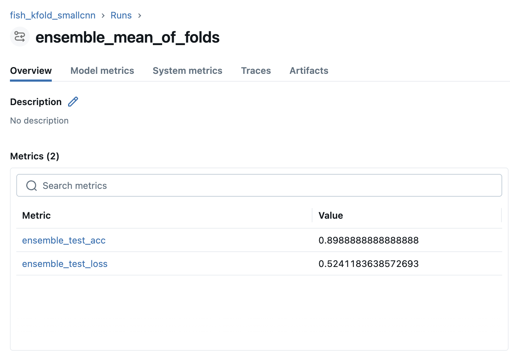

## Report: Fish Species Classification with K-Fold CNNs and Transfer Learning

### Dataset and preprocessing
We used the Kaggle *A Large-Scale Fish Dataset* and reorganized it into a clean `ImageFolder` layout. A key housekeeping step was removing the dataset’s **GT (ground-truth) directories**, keeping only the **image folders per class**, so PyTorch could treat each folder name as the label.

In EDA, we observed the dataset is **balanced**, with each class contributing roughly the same number of images (visible from the class distribution plot). We also sampled and visualized example images per class to sanity-check label quality and visual diversity.

During training we resized images to 224×224 and applied augmentation with `RandomHorizontalFlip(p=0.5)` and `RandomRotation(30)`, then converted to tensors. For evaluation (validation/test) we used only deterministic preprocessing (resize + tensor conversion) so metrics are comparable across runs.

A practical observation from EDA ended up mattering later: **some shrimp images appear fully horizontal**, which became a recurring misclassification pattern.

---

### Baseline model: SmallCNN + KFold evaluation
We started with a compact CNN trained from scratch using:
- **CrossEntropyLoss** (standard for multi-class single-label classification),
- **Stratified splits** (to preserve class balance per fold),
- Train-time augmentation (horizontal flip) and clean eval transforms.

#### Why we saw train vs validation differences
- Training uses augmentation, dropout, and gradient updates, so the model sees “harder” noisy variants.
- Validation and test use deterministic preprocessing, so accuracy can look higher if the dataset is consistent.
- If training accuracy is much higher than validation, it often indicates overfitting. In our case, the gap was small after basic regularization.

---

### Error analysis (Section 2b)
#### What we saw
The most consistent failure case was **Shrimp** being misclassified when the subject is **rotated or strongly horizontal**, especially when:
- the shrimp occupies a thin region of the image,
- the background dominates,
- the pose differs from the majority of shrimp examples.

#### Why it happens
Our initial baseline augmentation was limited, so it did not fully cover the orientation variability we saw in the errors.

Importantly, the rotation augmentation was added only after the error analysis. We saw that horizontally oriented shrimp examples were a recurring failure mode, so we updated the training transforms to include rotations specifically to teach the model that “sideways shrimp” is still shrimp.

#### At least 3 improvement ideas
1. Add rotation augmentation (most important here)
Teach the model that shrimp sideways is still shrimp.

2. Normalize inputs + stabilize conv blocks (BatchNorm)
Normalization helps optimization; BatchNorm improves training stability and often generalization.

3. Increase model capacity (more filters / deeper)

---

### Implemented improvements (Section 2c)
We prioritized and implemented the first two:
1. **Rotation augmentation** (helps horizontal shrimp cases).
2. **SmallCNN upgrade**: BatchNorm + AdaptiveAvgPool2d + a smaller classifier head.

After these changes, we repeated the misclassification inspection and observed fewer confident wrong predictions for the “horizontal shrimp” pattern, and improved behavior on uncertain examples.

---

### Transfer learning (Section 3 summary)
We fine-tuned multiple pretrained architectures by replacing their final classifier layer to match the number of fish classes. This produced **improved performance compared to the from-scratch SmallCNN**, which is expected because pretrained models start with strong general visual features.

#### Feature extractor experiment (Section 3d)
We also used a fine-tuned **ResNet** as a **feature extractor** by bypassing its last classification layer, extracting embeddings, then training a **classical ML model** (Logistic Regression) on those embeddings.

We observed **almost no difference** between:
- end-to-end fine-tuned ResNet classification, and
- ResNet embeddings plus Logistic Regression.

In our run, the accuracy difference was approximately **0.0005555555555555314**, meaning the feature-extractor approach performed essentially the same as the full neural classifier head.

---

### Experiment summary table (from the notebook)
Processing notes: training used `RandomHorizontalFlip + RandomRotation(30)` before the official weights preprocessing (resize, tensor, normalize). Evaluation used the official weights preprocessing only.

| Model Name      | # Parameters  | Validation Loss | Validation Accuracy | Test Loss  | Test Accuracy | # unique correct samples | # unique errors | Runtime (sec) | Params / Notes |
|---|---:|---:|---:|---:|---:|---:|---:|---:|---|
| resnet18        | 11,181,129    | 0.006320        | 1.000000            | 0.007805   | 1.000000      | 0                      | 0              | 943.83       | epochs=2, batch=32, lr=1e-4, wd=1e-4 |
| efficientnet_b0 | 4,019,077     | 0.001625        | 1.000000            | 0.001592   | 1.000000      | 0                      | 0              | 3428.23      | epochs=2, batch=32, lr=1e-4, wd=1e-4 |
| vgg16_bn        | 134,305,865   | 0.008016        | 0.997222            | 0.006642   | 0.997778      | 0                      | 4              | 4938.97      | epochs=2, batch=32, lr=1e-4, wd=1e-4 |
| densenet121     | 6,963,081     | 0.002804        | 1.000000            | 0.002705   | 1.000000      | 0                      | 0              | 2997.55      | epochs=2, batch=32, lr=1e-4, wd=1e-4 |

Notes:
- “# unique errors” highlights samples that were misclassified by a specific model when others were correct. In this run, VGG16_BN produced a small number of unique mistakes.
- The very high accuracies suggest the dataset is visually consistent and relatively easy once preprocessing and training are correct.

---

### Takeaways
- **EDA mattered**: spotting “horizontal shrimp” early gave us a concrete failure mode to target.
- **Simple augmentations beat guessing**: adding rotation was a direct fix for the observed errors.
- **Architecture changes improved stability**: BatchNorm and AdaptiveAvgPool helped the small CNN generalize better.
- **Transfer learning was the biggest boost**: pretrained backbones delivered the most consistent high performance.
- **Feature extraction is a strong baseline**: ResNet embeddings plus Logistic Regression matched end-to-end performance almost exactly (difference around 0.00056).

---

### MLflow results: SmallCNN baseline vs BatchNorm + MaxPooling
We tracked experiments in MLflow and compared the baseline SmallCNN run to the improved SmallCNN variant that includes BatchNorm in the convolution blocks and MaxPooling for downsampling. The MLflow curves show a clear jump in accuracy and a corresponding drop in loss after this architecture change.

Why this helps:
- BatchNorm stabilizes activation distributions during training, making optimization smoother and typically improving generalization.
- MaxPooling reduces spatial resolution while keeping strong local responses, adding translation robustness and reducing overfitting to exact pixel locations.

Below are the MLflow screenshots for before and after the change. The improved model even compares to some pretrained architectures in terms of accuracy!

